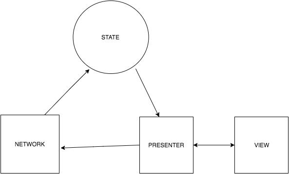

# dehub-android

A simplified overview of the app architecture:

``NETWORK`` - makes network requests using Retrofit with the RxJava adapter. When a network request completes, ``NETWORK`` can either forward it directly to a ``PRESENTER`` or it can uptate the ``STATE`` with the new data.

``STATE`` - acts as an in-memory cache of the data fetched by ``NETWORK``. It exposes the state as RxJava Observables that the ``PRESENTER`` observes.

``PRESENTER`` - contains the main logic of the app. It's responsibilities are:
* Observe the ``STATE`` and react when it changes.
* Observe the ``VIEW`` and react when the user interacts with it.
* Let ``VIEW`` know what UI it should display.
* Let ``NETWORK`` know when it should fetch data.

``VIEW`` - renders the UI. Forwards UI events (e.g. a button was clicked) to the presenter. The ``VIEW`` does not contain any application logic, it is only concerned with displaying the UI.

# Example: Displaying the list of the user's gists

When the user first logs in, the app should fetch the users gists and display them in a list. The following is roughly what happens:

1. The ``view`` (a fragment) is displayed on the screen by Android.
2. The ``presenter`` is created when the ``view`` is created.
3. The ``presenter`` is notified that the ``view`` has been created and is active.
4. The ``presenter`` calls a method on the network, requesting that it fetches the user's gists.
5. Once the network request completes (and is successful) the ``network`` updates the ``state`` with the user's gists.
6. The ``presenter`` listens to the ``state`` and receives a callback with the new data when it changes.
7. The ``presenter`` forwards the list of gists to the ``view``.
8. The ``view`` displays the list of gists on the screen.
