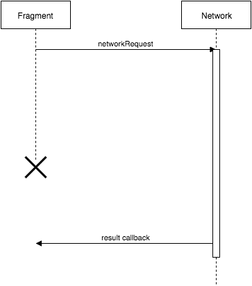

# dehub-android

## Synopsis

dehub is an app that can be used to view your gists and to create new gists.
It is written using a MVP-like architecture.

A simplified overview of the app architecture:

``NETWORK`` - makes network requests using Retrofit with the RxJava adapter. When a network request completes, ``NETWORK`` can either forward it directly to a ``PRESENTER`` or it can uptate the ``STATE`` with the new data.

``STATE`` - acts as an in-memory cache of the data fetched by ``NETWORK``. It exposes the state as RxJava Observables that the ``PRESENTER`` observes.

``PRESENTER`` - contains the main logic of the app. It's responsibilities are:
* Observe the ``STATE`` and react when it changes.
* Observe the ``VIEW`` and react when the user interacts with it.
* Let ``VIEW`` know what UI it should display.
* Let ``NETWORK`` know when it should fetch data.

``VIEW`` - renders the UI. Forwards UI events (e.g. a button was clicked) to the presenter. The ``VIEW`` does not contain any application logic, it is only concerned with displaying the UI.

# Example: Displaying the list of the user's gists

When the user first logs in, the app should fetch the users gists and display them in a list. The following is roughly what happens:

1. The ``view`` (a fragment) is displayed on the screen by Android.
2. The ``presenter`` is created when the ``view`` is created.
3. The ``presenter`` is notified that the ``view`` has been created and is active.
4. The ``presenter`` calls a method on the network, requesting that it fetches the user's gists.
5. Once the network request completes (and is successful) the ``network`` updates the ``state`` with the user's gists.
6. The ``presenter`` listens to the ``state`` and receives a callback with the new data when it changes.
7. The ``presenter`` forwards the list of gists to the ``view``.
8. The ``view`` displays the list of gists on the screen.

# Dealing with the Android lifecycle

The app uses an Activity and displays different Fragments depending on what screen the user is at in the app. The Fragments do not call ``setRetainInstanceState(true)`` which means that both the Activity and the Fragments will be destroyed and recreated on a configuration change (i.e. a screen rotation). This approach can lead to problems when we invovle asynconous operations such as a network request. Consider the following diagram:

The Fragment starts a network request with a callback that is called when the network request finishes. If there is a configuration change before the network request completes, the Fragment is destroyed when the callback is executed. This will either lead to a crash or that the data of the request is not displayed.

The MVP library [Nucleus](https://github.com/konmik/nucleus) helps with solving this problem. Using the Nucleus model it is not the Fragment that initiates the network request with a callback. This is now the responsibility of the Presenter. The Presenter initiates the request, and inside of the callback it gets the current existing Fragment. If there was no configuration change, this will be the Fragment instance that existed when the Presenter initiated the request. If there was a configuration change this will be the newly created Fragment. So the callback will always access the active Fragment, and never an old, destroyed one.

This works because Nucleus will not destroy a Presenter on a configuration change. Instead the Presenter will be notified that it's current Fragment is no longer active, and that a new Fragment has been created.

You might think that this would lead to a race condition if the network request completes during a configuration change. However, this is not the case because all network callbacks are posted to the UI thread, and during a configuration change Android destroys the old Fragment and creates a new one all within one message the UI thread. This means that the callback will either execute right before the Fragment is destroyed, or right after the new Fragment has been created. For more information see this [article](https://medium.com/square-corner-blog/a-journey-on-the-android-main-thread-lifecycle-bits-d916bc1ee6b2#.v2mcyfn10).

# Libraries used

##[RxJava](https://github.com/ReactiveX/RxJava)##

Used for observing the result of network requests (with Retrofit's RxJava adapter) and observing the UI state (with RxView).

__Learning resources:__
* [Grokking RxJava](http://blog.danlew.net/2014/09/15/grokking-rxjava-part-1/) - A good place to start learning.
* [Common RxJava Mistakes](https://www.youtube.com/watch?v=QdmkXL7XikQ) - Watch this once you have some familiarity with RxJava. Then watch it again when you get more comfortable with RxJava.
* [Reactive Programming with RxJava](http://shop.oreilly.com/product/0636920042228.do) - A good in-depth book on RxJava.

##[Retrofit](https://github.com/square/retrofit)##

A REST library. Supports declaratively defining a REST API via an interface. Has adapters for common JSON parsing libraries (this app uses Gson) and an adapter for returning the result of a network request as an RxJava Observable.

__Learning resources:__
* https://square.github.io/retrofit/ - A high level tutorial.

##[Nucleus](https://github.com/konmik/nucleus)##

The Model-View-Presenter library. Nucleus enables the use of presenters for Activies, Fragments, and (Android) Views. It handles Android lifecyle issues such as when the user rotates the screen and makes sure that the presenter and view does not go out of sync.

__Learning resources:__
* https://github.com/konmik/konmik.github.io/wiki/Introduction-to-Model-View-Presenter-on-Android - an intro of MVP and Nucleus.

##[Dagger 2](https://github.com/google/dagger)##

Dagger 2 is a depencency injection library that does not use any relection (which can be expensive on Android) and instead uses code generation. Dagger 2 is used to inject dependencies in to Presenters and various model classes such as the Retrofit API.

__Learning resources:__
* [Dependency Injection with Dagger 2](https://github.com/codepath/android_guides/wiki/Dependency-Injection-with-Dagger-2) - A good tutorial.

